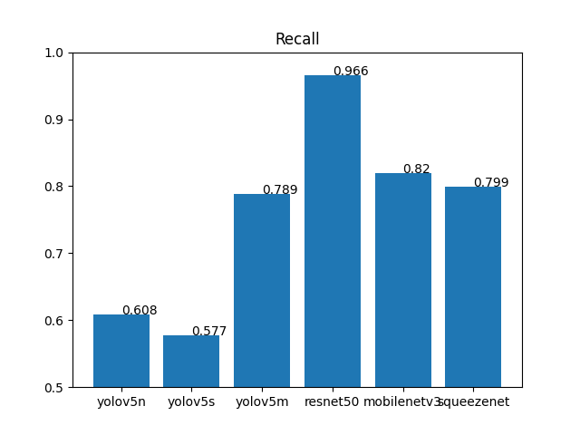
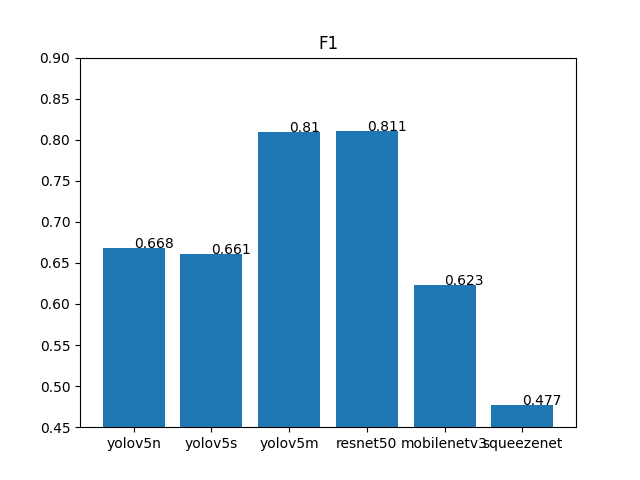

# acini-project

Progetto sul confronto tra reti neurali per l'individuazione di acini d'uva.
## DATASET

Il dataset utilizzato è stato creato da zero, etichettando manualmente immagini fornite tramite questo [software](https://github.com/heartexlabs/labelImg), per allenare le reti ho effettuato una suddivisione del dataset con queste percentuali: 50% training set, 17% validation set, 33% test set.

## RETI NEURALI

Le reti utilizzare sono [Yolov5](https://github.com/ultralytics/yolov5) e [Faster R-CNN](https://github.com/sovit-123/fasterrcnn-pytorch-training-pipeline) 

## ALLENAMENTO (DA COMPLETARE)

Andamento dell' allenamento yolov5:

Andamento dll'allenamento di Faster R-CNN

## RISULTATI

Per ottenere alcune metriche sul test set ho usufruito di alcune funzioni di questa [pagina](https://github.com/rafaelpadilla/review_object_detection_metrics), il resto le ho calcolate io stesso utilizzando il file `plot_data.py`. Per ottenere i file csv (le cui righe descrivono la posizione di una bounding box) necessari per utilizzare `plot_data.py` bisogna eseguire :
- `groundtruths_bb.py`
- `yolo_boxes_to_csv.py`
- `inference.py`, questo è il file che è presente nella repo di faster R-CNN modificato da me per ottenere il file csv

Ecco i risultati delle performance

<table cellspacing="2" cellpadding="2" width="1200" border="0">
<tbody>
<tr>
<td valign="center" width=400"></td>
<td valign="center" width="400"></td>
</tr>
<tr>
<td valign="center" width=400"></td>
<td valign="center" width="400"></td>
</tr>
<tr>
<td valign="center" width="400"></td>
<td valign="center" width="400"></td>
</tr>
</tbody>
</table>

